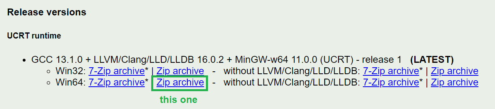

<!-- headingDivider: 3 -->
<!-- class: default -->

# Building TIC-80

## So, you want to make TIC-80 better.

* If you forgot to clone recursively, you have to run:
	* `git submodule update --init --recursive`.

## The building process

* Building TIC-80, like most software, is a two-part process.
* First, we generate the ***Makefile***: "building instructions" for the hardware we want to build for.

## Building on Windows with MinGW

### Prerequisites

* Git (See [Git setup](project-management/0-git-setup))
* [Cmake](https://cmake.org/download/)
  * Download Windows x64 Installer
* [Ruby](https://rubyinstaller.org/downloads/)
  * Install newest version with Devkit
* [MinGW-w64](http://mingw-w64.org) (see next slide!)
  * Good luck finding anything on the official website
  * You have two options, described below

### MinGW Option 1. MinGW bundled with Ruby

* Ruby comes with MinGW, so you don't even need to install anything extra
* `<ruby-installation-folder>\msys64\ucrt64\bin`
  * For me it was `C:\Program Files (x64)\Ruby31-x64\msys64\ucrt64\bin`
* Add this folder to system path environment variables (see instructions [here](project-management/command-line-and-the-environment.md#windows-environment-variables))

### MinGW option 2. Winlibs

* Go to [winlibs.com](https://winlibs.com/) and download the latest Win64 UCRT runtime as a zip archive

	

* Unzip the archive.
* Move the `mingw64` folder to `C:\` (or whatever you'd like)
* Add the `C:\mingw64` folder to system path environment variables (see instructions [here](project-management/command-line-and-the-environment.md#windows-environment-variables))

### Check that MinGW works

* To check MinGW works for you, open a new command prompt and run `gcc --version`
  * It should output `gcc (Rev6, Built by MSYS2 project) 12.2.0` or some other version
  * If the version is 4.8, building won't be successful and you need to update your MinGW 
