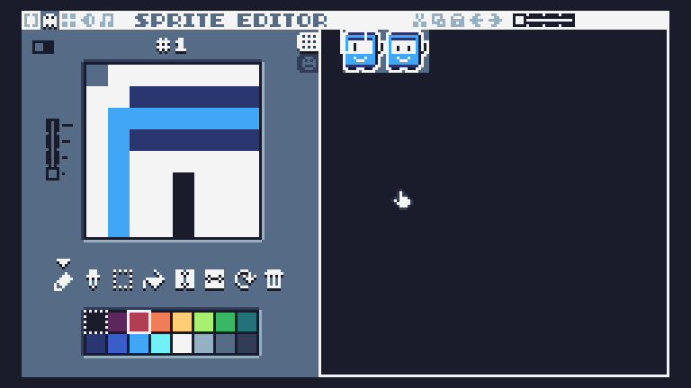

<!-- headingDivider: 3 -->
<!-- class: default -->

# Achieve gamedev nirvana with TIC-80

## What is TIC-80?

* TIC-80 is a free and open source ***fantasy computer***
  * Similar to [Pico-8](https://www.lexaloffle.com/pico-8.php), the most well-known fantasy console
  * More versatile, though. No shade
* Great for making, playing and sharing ***tiny games***
* ***Built-in tools*** for development: code, sprites, maps, sound editors and the command line
* ***Artificial limitations:*** low resolution, color palette, chiptune channels, game size...
* The game is stored as a `.tic` ***cartridge file*** 
  * It can be uploaded to the [TIC-80 website](http://tic80.com/)
  * (...but you can also export executables!)

## What can you make with TIC-80?

* [Bare bones](http://tic80.com/play?cart=139)
  * 2D dungeon crawler
* [Supernova](http://tic80.com/play?cart=645)
  * 3D racer
* [Fallspire](http://tic80.com/play?cart=806)
  * Demoscene demo
* [EMUUROM](https://store.steampowered.com/app/1634360/EMUUROM/)
  * A full-fledged Steam release?!?

## Basic navigation

* TIC-80 boots into the command line
  * This is used for debugging and moving in the filesystem
* You can move between the editor view and the command line by pressing ***ESC***
* You can move between different editors with the ***F*** keys
* More hotkeys [here](https://github.com/nesbox/TIC-80/wiki/Hotkeys) 

## Editors
### Code editor (F1)


* 64KB of code
### Sprite editor (F2)


* 512 8x8 sprites divided into foreground and background
* Changeable 16-color palette
### Map editor (F3)


* A single-layer map of 240x136 8x8 tiles

### Sfx editor (F4)


* 16 sound waveforms you can draw yourself
* 64 instruments

### Music editor (F5)

* 8 tracks consisting of 60 patterns

Piano roll view:


---
Tracker view:


## [Display](https://github.com/nesbox/TIC-80/wiki/display) coordinates


## What about the nirvana part though

* Only one window: no distractions!
* No compile time: Test your creations *INSTANTLY*.
* No bullshit: If you want to paint a pixel red in `(x=30, y=15)`, you *can*. 
* Low resolution & ready-to-use 16 color palette: 
  * Some decisions are already premade for you, by the engine.
  * Just make your game.
* Limited yet *expressive* set of tools
  * Limitations breed creativity, after all!

## Hello world game

* Use the `new lua` command to create a new default cartridge programmed in Lua
* Use the command `run` or press ***CTRL+R*** to run the game.
* ***ESC*** pauses the game.
* Let's now remove the default code and try to recreate the important parts.
---
* The most important function we need is [TIC](https://github.com/nesbox/TIC-80/wiki/TIC), the ***main loop*** which runs in 60 fps.
  * Inside it, you put everything that you want to ***update & draw on screen***
* So let's put a [print](https://github.com/nesbox/TIC-80/wiki/print) call inside it to draw ***text*** on screen
* We can also use the [spr](https://github.com/nesbox/TIC-80/wiki/spr) function to draw a ***sprite***
* Then, we can make the sprite move by getting ***input***: [btn](https://github.com/nesbox/TIC-80/wiki/btn)
* Now we notice that the ***screen doesn't get cleared*** automatically. Let's call [cls](https://github.com/nesbox/TIC-80/wiki/cls)
* ...and we're done! 

## Lua in a nutshell

* Lua is the default programming language of TIC-80. 
  * [Some others](https://github.com/nesbox/TIC-80/wiki/supported-languages) are supported as well
* [Learn Lua in 15 minutes](https://tylerneylon.com/a/learn-lua/)
* Lua is a Python-like dynamic language where indents don't matter. 
  * ```Lua
  	if huge then return true end
	```
  * ```Lua
  	for i=1,10 do trace(i) end
	```
  * ```Lua
	function increment(a) return a+1 end
	```
---
* By default, every variable has a "falsy" `nil` value
* Variables are `global` by default (use the `local` keyword!)
* Tables are everything and can have everything
  * You can have numbered and named keys in the same table
	```Lua
	tbl = {"hello", "world", name = "sillyTable",}
	for index, value in pairs(tbl) do
		trace(value)
	end
	```
* Gotchas
  * Table indexing starts from one: `tbl[1]`
  * ```Lua
	if a ~= 3 then trace("a is not 3") end
	```
  * `+=` does not exist


## Important API functions

* [API](https://github.com/nesbox/TIC-80/wiki/API)
### Basics


* [TIC](https://github.com/nesbox/TIC-80/wiki/TIC)
	* Callback function for the main loop. Called once per frame, 60 times per second
* System
  * [trace](https://github.com/nesbox/TIC-80/wiki/trace): Print to console "`Debug.Log`"
  * [time](https://github.com/nesbox/TIC-80/wiki/time): Get time passed after the game started
  * [reset](https://github.com/nesbox/TIC-80/wiki/reset): Reset the game
### Drawing
* [cls](https://github.com/nesbox/TIC-80/wiki/cls): Clear screen
* [print](https://github.com/nesbox/TIC-80/wiki/print): Print text
* [spr](https://github.com/nesbox/TIC-80/wiki/spr): Draw sprite
* [pix](https://github.com/nesbox/TIC-80/wiki/pix): Draw a pixel
* [line](https://github.com/nesbox/TIC-80/wiki/line): Draw a line
* [map](https://github.com/nesbox/TIC-80/wiki/map): Draw tilemap
* [circ](https://github.com/nesbox/TIC-80/wiki/circ) & [circb](https://github.com/nesbox/TIC-80/wiki/circb): Circle & Circle border
* [tri](https://github.com/nesbox/TIC-80/wiki/tri), [ttri](https://github.com/nesbox/TIC-80/wiki/ttri) & [trib](https://github.com/nesbox/TIC-80/wiki/trib): Triangle, Textured triangle & Triangle border
* [rect](https://github.com/nesbox/TIC-80/wiki/rect) & [rectb](https://github.com/nesbox/TIC-80/wiki/rectb): Rectangle & Rectangle border
### Input

* Controller & keyboard (by default, ABXY buttons are mapped to ZXAS keys)
  * 0,1,2,3,4,5,6,7: up, down, left, right, A, B, X, Y
  * See [Keymap](https://github.com/nesbox/TIC-80/wiki/key-map) for the rest (multiplayer for up to 4 controllers supported!)
  * [btn](https://github.com/nesbox/TIC-80/wiki/btn): Get continuous input. "`GetButton`"
  * [btnp](https://github.com/nesbox/TIC-80/wiki/btnp): Get input for only one frame. "`GetButtonDown`"
* [key](https://github.com/nesbox/TIC-80/wiki/key) & [keyp](https://github.com/nesbox/TIC-80/wiki/keyp): Get input from keyboard "`GetKey`" & "`GetKeyDown`"
  * [Keyboard keycodes](https://github.com/nesbox/TIC-80/wiki/key)
* [mouse](https://github.com/nesbox/TIC-80/wiki/mouse): Mouse input

### Sound

* [sfx](https://github.com/nesbox/TIC-80/wiki/sfx): Play a sound effect
* [music](https://github.com/nesbox/TIC-80/wiki/music): Play music

### Memory

* [mget](https://github.com/nesbox/TIC-80/wiki/mget) & [mset](https://github.com/nesbox/TIC-80/wiki/mset): Get & set tile in tile map
* [fget](https://github.com/nesbox/TIC-80/wiki/fget) & [fset](https://github.com/nesbox/TIC-80/wiki/fset): Get & set sprite flag
* [pmem](https://github.com/nesbox/TIC-80/wiki/pmem): Get or set value in persistent memory (load & save!)
* [peek*](https://github.com/nesbox/TIC-80/wiki/peek) & [poke*](https://github.com/nesbox/TIC-80/wiki/poke): manipulate internal RAM & VRAM
  * [Memory layout](https://github.com/nesbox/TIC-80/wiki/RAM)
### Tricks

* [BDR](https://github.com/nesbox/TIC-80/wiki/BDR)
  * Callback function for drawing or manipulating stuff between every "scanline", plus border
  * Called 143 times per frame 
* [Manipulating the color palette](https://github.com/nesbox/TIC-80/wiki/palette)
* [More graphics with less colors: bits per pixel](https://github.com/nesbox/TIC-80/wiki/Bits-Per-Pixel)


## Console

* [Console: Available commands](https://github.com/nesbox/TIC-80/wiki/Console#available-commands)
  * `new`, `load`, `save`: manage cartridges
  * `run`: run loaded game
  * `resume`: when running a game, you can go to console with ***ESC*** and resume play
  * `folder`: open the working directory in the host OS
  * `help`: Show available commands, or explanation for API functions & specific commands
  * `export`: Export game or assets (very versatile)
    * `export win`
    * `export music id==1`: Export song 1
    * etc... 


## Sprites...

## Map...

## Sfx...

## Music...

## Examples
### Boilerplate code

* Button indices (so no need to remember numbers with btn)
	```
	UP=0
	DOWN=1
	LEFT=2
	RIGHT=3

	A=4 --z
	B=5 --x
	X=6 --a
	Y=7 --s
	```
---
* Math shorthands & helper functions
	```Lua
	pi=math.pi
	max=math.max
	min=math.min
	sin=math.sin
	cos=math.cos
	exp=math.exp
	abs=math.abs
	sqrt=math.sqrt
	rnd=math.random
	floor=math.floor
	ceil=math.ceil
	angle=function(x,y)return math.atan2(y,x)end

	function sign(n) return n>0 and 1 or n<0 and -1 or 0 end
	function clamp(n,lo,hi) return min(max(n,lo),hi) end
	function lerp(a,b,t) return (1-t)*a+t*b end--t=0..1
	function dist(a,b) return sqrt(a^2+b^2) end
	function round(num, decplaces)
		local mult = 10^(decplaces or 0)
		return math.floor(num * mult + 0.5) / mult
	end
	function AABB(e,v)
		return v~=e and e.x+e.w>v.x and e.x<v.x+v.w and e.y+e.h>v.y and e.y<v.y+v.h
	end
	```

---
* Table shorthands & helper functions
	```Lua
	str=string.format
	del=table.remove
	to=table.insert
	sort=table.sort

	function rm(tbl,E)
		for i,v in ipairs(tbl)do if v==E then del(tbl,i)return end end
	end
	function has(tbl,val)--if tbl has val, returns key
		for k,v in pairs(tbl)do if v==val then return k end end
		return false
	end
	function any(tbl,cond)for i,v in pairs(tbl)do if cond(v,i)then return true end end return false end
	function one(tbl,cond)local n=0;for i,v in pairs(tbl)do if cond(v,i)then n=n+1 end end return n==1 end 
	function all(tbl,cond)for i,v in pairs(tbl)do if not cond(v,i)then return false end end return true end
	function find(tbl,cond)for i,v in pairs(tbl)do if cond(v,i)then return v end end end
	function filter(tbl,cond)
		local filtered={}
		for i,v in pairs(tbl)do if cond(v,i)then to(filtered,v)end end
		return filtered
	end
	function ripairs(t)--reverse ipairs. https://gist.github.com/balaam/3122129
		return function(t,i)
			i=i-1
			if i~=0 then return i,t[i]
			end
		end, t,#t+1
	end
	```
	* [Deepcopy](deepcopy.lua) & [Table print](tableprint.lua)
### Simple structure example

```Lua
ents = {}
table.insert(ents, {
	spr=1,x=0,y=0,
	upd=function(E)
		E.x=btn(2) and E.x-1 or btn(3) and E.x+1 or E.x
		E.y=btn(0) and E.y-1 or btn(1) and E.y+1 or E.y
	drw=function(E)
		spr(E.spr,E.x,E.y)
	end
})
function TIC()
	for i,E in ipairs(ents)do
		E:upd()
	end
	for i,E in ipairs(ents)do
		E:drw()
	end
end

```

### Simple tile collision
```Lua

function tile(x,y)
	x,y=(x)//8,(y)//8 --floor division
	local id=mget(x,y)--get tile id in given coordinates
	return {x=x*8,y=y*8,id=id}
end

function collision(ent) --A very simple tilemap collision detection.
	--if tile has flag 1, it's regarded as a collision (set in sprite editor)
	local tils
	ent.x=ent.x+ent.dx --x direction collision.
	if ent.dx<0 then --going left
		tils = {tile(ent.x,ent.y),tile(ent.x,ent.y+7)}
		for i,til in ipairs(tils) do
			if fget(til.id,1) then ent.x = til.x+8 end
		end
	else --going right or staying in place
		tils = {tile(ent.x+8,ent.y),tile(ent.x+8,ent.y+7)}
		for i,til in ipairs(tils) do
			if fget(til.id,1) then ent.x = til.x-8 end
		end
	end
	ent.y=ent.y+ent.dy --y direction collision.
	if ent.dy<0 then --going up
		tils = {tile(ent.x,ent.y),tile(ent.x+7,ent.y)}
		for i,til in ipairs(tils) do
			if fget(til.id,1) then ent.y = til.y+8 end
		end
	else --going down or staying in place
		tils = {tile(ent.x,ent.y+8),tile(ent.x+7,ent.y+8)}
		for i,til in ipairs(tils) do
			if fget(til.id,1) then ent.y = til.y-8 end
		end
	end
end

```

## More nirvana

* Small API
  * We basically went through 80% of it already
  * Takes very little time to learn *EVERYTHING* about the engine!
* No game-breaking engine updates
  * Before 1.0, updates have brought *some* changes
  * Changes can still happen, but it's fast to migrate your project to the newest version
* Open-source: You can make your own forks of the engine and suggest changes, bugfixes, new features....
* Ever growing friendly community ([Discord](https://discord.gg/3zek7yJD) & [Telegram](https://t.me/tic80))

## Pro mode

* There's also a paid ($10) [PRO version](https://nesbox.itch.io/tic80) of TIC-80
* 8 times the size with ***memory banks***
  * You can swap between e.g., different sprite banks in runtime 
    * (only one swap per frame per bank!)
  * 8 times 64KB for code, no banks
* You can save cartridges as text (`.lua`, etc) so you can edit code in [external editors](https://github.com/nesbox/TIC-80/wiki/external-editor)
  * Also, because your whole game is stored as a text file, you can easily extend TIC-80 functionality with Python scripts and the like
* ***Bonus:*** You can export games to executables that don't contain the TIC-80 editors
* ***Bonus 2:*** Separate your game into multiple files with `require("file.lua")`!

## Where to learn

* [Learn Lua in 15 minutes](https://tylerneylon.com/a/learn-lua/)
* [The TIC-80 wiki](https://github.com/nesbox/TIC-80/wiki)
  * [API](https://github.com/nesbox/TIC-80/wiki/API)
  * [Tutorials](https://github.com/nesbox/TIC-80/wiki/tutorials)
    * [The default cart](https://github.com/nesbox/TIC-80/wiki/A-step-by-step-introduction-to-TIC-80,-Part-1---The-Default-Cart)
* `help` command
  * Write e.g., `help print` to know how the `print` function is used
* [tic80.com: Tool cartridges](http://tic80.com/play?cat=2&sort=2)


## In a nutshell

* All tools in one window: Fast prototyping!
* Create retro-ish games with direct memory access 
  * ...but with the convenience of dynamic programming languages
  * (bonus: get cool retro glitches!)
