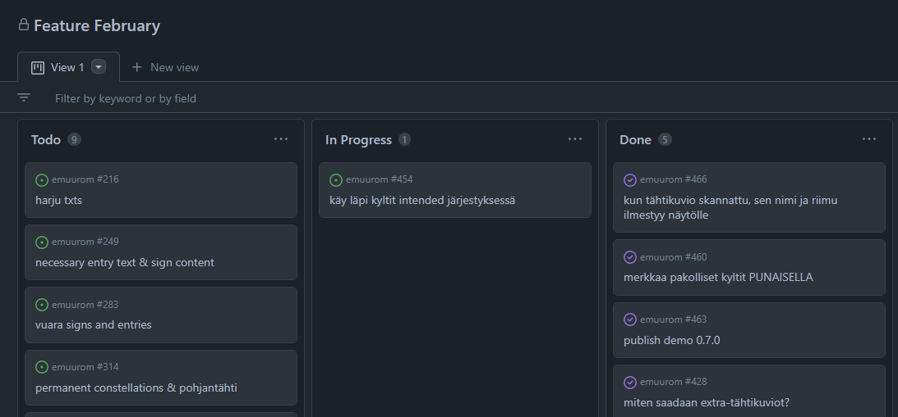

<!-- headingDivider: 3 -->
<!-- class: invert -->

# Project management 3. GitHub tools

## Issues

* Issues: tasks that need to be done
  * Use for sprint tasks!
* Creating a new issue
  * You can add a description
  * You can set an ***assignee*** to an issue
  * You can tag issue with a ***label***
    * Feature, bug, code
    * level design, story...
  * You can also link issue to a ***project*** 
* When issue is done, you close it with ***Close issue***

---

* ***Note:*** You can auto-close an issue with a commit message `"fix #<issuenumber>"` or `"close #<issuenumber>"`
* ***Note:*** You can add todo lists into the description!
  * Todo list can include links to other issues (just write #issuenumber)
  * Don't create a mega-issue "Sprint 1" or something like that, however
  * We have a better tool for that...

## Projects

* A board that can be used to track sprint progress
* GitHub has two Projects views
  * Projects
    * Under one repo
  * Projects (Beta)
    * Can have issues from multiple repos

---

* Create a new project (not beta) for every sprint under Projects Tab > Projects (not beta!) > New Project
  * Give name "Sprint 1"
  * Use Project template "Automated kanban"
  * Delete the default notes
* Now, when an issue is closed, it jumps automatically to Done column

---

* Kanban board has by default three columns of issues & notes
  * To do
  * In Progress
  * Done
* There can be issues, pull requests and notes in the columns
* Notes can be converted into issues

---

## Pull requests

* The recommended way to merge a feature branch into the master branch
* When a branch is ready to be merged into master, create a pull request in this tab
* If the master branch maintainer doesn't accept it right away, they can comment on the pull request page what needs to be changed before merge can be completed
* If "All comments need to be resolved" is checked, the merge can only be completed after you've addressed the issues and the maintainer has approved the changes!
* After making these changes, you don't have to create a new pull request, new commits are automatically added to the one already created

---

<!--

## Actions

## GitHub for Unity

- a free Unity plugin
- makes communicating with GitHub easier and integrated into Unity
-->

<!--
### Github

* gotcha: logging into Github
  * cannot use password anymore, you have to create a token for https. https://github.blog/2020-12-15-token-authentication-requirements-for-git-operations/#what-you-need-to-do-today
  * repo, workflow, gist

 Collaboration tools
	* Unity collab
	* git
-->