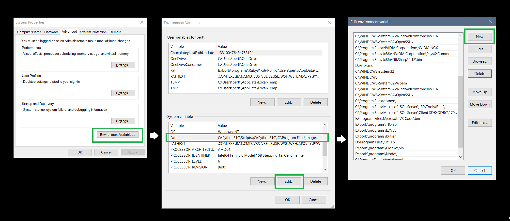

<!-- headingDivider: 3 -->
<!-- class: invert -->

# Command line and the environment

## Terminals

* There are many kinds of command line syntaxes out there. Some examples:
  * Windows: ***PowerShell*** (new), ***cmd*** (old)
  * Linux, (also included in the Windows Git install): ***bash***
* We're using PowerShell, which can be accessed inside VS Code
* In VS Code, open/close terminal by pressing ***CTRL+Ö*** (in the Fin/Swe layout)

## Basic commands and the working directory

* To do actions in a terminal, you don't press buttons, you write commands
* Most commands act on the currently open folder, a.k.a. the ***working directory***
  * ***Path*** to the directory is shown next to the terminal cursor:
    `PS E:\borb\code\unity-basics-course>`
* `ls` tells the contents of the working directory

## Moving around

* `cd` is used to move to another directory
  * Use `cd programming` to move to the `programming` subfolder
    `PS E:\borb\code\unity-basics-course\programming>`
  * Use `cd ..` to move one step up in the hierarchy (to the parent directory)
    `PS E:\borb\code\unity-basics-course>`
* ***Note***: `..` is a shorthand for to the parent directory, `.` for the current directory

## Windows: Environment variables

* To be able to run some program, like `git`, from any working directory, its installation folder needs to be added to ***System Path***
  * Usually, the software installer handles it for you
  * Sometimes, you need to do it yourself.
* System path (or just Path) is one of the ***Environment variables***
	* Search in Start menu for environment variables
	* Choose *Edit the system environment variables*
	* Click *Environment variables*
	* Choose *Path* under *System variables* and click *Edit*
	* Choose *New*
	* Either click *Browse* or just paste the directory path in the text box

---

